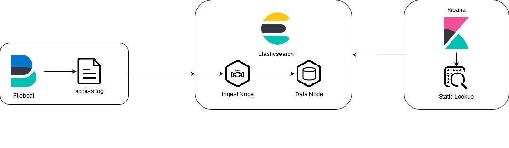

# Overview
In this PoC a [kibana static lookup](https://cinhtau.net/2018/08/27/static-lookup/) is used to map http status codes to status code text.
[Filebeat](filebeat) is used to ingest data into elasticsearch.

Diffrent to the other data-processing PoCs ([uc4_enrichment_policy](../uc4_enrichment_policy) and [uc5_logstash_lookup](../uc5_logstash_lookup/)) the lookup values aren't indexed with the rest of the data, but rather are looked up during search and are solely present in kibana itself.
# Usage
To run the PoC simply execute the run.sh script. It will start all the docker-container and apply runtime configuration, aswell as output log messages and cleanup after you exit.
## Runtime Configuration
Elasticsearch and Kibana uses a custom runtime configuration to create an [index-template](https://www.elastic.co/guide/en/elasticsearch/reference/master/index-templates.html), the ingest-pipeline and an [index-pattern](https://www.elastic.co/guide/en/kibana/master/index-patterns.html) with the static kibana lookup.
This configuration is created when starting the docker-environment using the `run.sh` script.
The scripts used to perform runtime object creation can be found in the [setup](setup)-directory.
- `00_cleanup.sh`: cleanes up index-templates, pipelines, etc. from previous runs.
- `01_create-index.sh`: Creates an index-template called `http_access_logs_template`, which is applied to every created index, which matches the pattern `http_access_logs*`. Defines index-settings, such as `number_of_shards`, `number_of_replicas` and [field-mappings](https://www.elastic.co/guide/en/elasticsearch/reference/current/mapping.html).
- `02_create-pipeline`: Creates the ingest-pipeline used to parse log events before they get indexed by elasticsearch.
- `03_create_kibana_index_pattern.sh`: Creates a kibana-index-pattern, which matches all `http_access_logs*`-indexes and sets the `timeFieldName` to `timestamp`.
- `04_create-static-lookup.sh`: Updates the kibana-index-pattern `http_access_logs_pattern` to include a (very basic) static lookup for http status codes.
