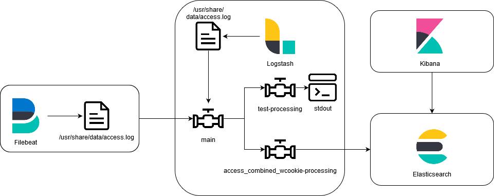

# Overview
This PoC uses Logstash as the main ingesting component.
Logstash uses diffrent input-methods to either receive data from remote clients such as beats or tcp, or read local log files.

In this PoC data is received by logstash either by beats or tcp and reads the access.log file in the local `/usr/share/data` directory.
Filebeat is used to monitor the same file on the local filebeat filesystem and output the data to logstash.

When Logstash receives data in the main-pipeline, data is then forwarded either to the `access_combined_wcookie-processing` or `test-processing` pipeline.
When forwarded to the `access_combined_wcookie-processing` pipeline, the message field is parsed using a `grok` filter and the parsed data is outputted to elasticsearch using the `elasticsearch` output plugin.

## Logstash-Pipelines
There are 3 diffrent pipelines, which are used by Logstash:
- [main](logstash/pipeline/pipelines.d/main)
- [access_combined_wcookie-processing](logstash/pipeline/pipelines.d/access_combined_wcookie-processing)
- [test-processing](logstash/pipeline/pipelines.d/test-processing)

The pipelines are setup in a way that the main-pipeline forwards data to the other two pipelines based on some criteria.
The other two pipelines receive that from the main-pipeline, processes them and forwards them to a specific output.

A similar setup is also described in a blog post by elastic: https://www.elastic.co/blog/how-to-create-maintainable-and-reusable-logstash-pipelines

## Elasticsearch Configuration
Elasticsearch uses a custom index-template to set index-settings.
This index-template is created when starting the docker-environment using the `run.sh` script.
The scripts used to perform runtime object creation can be found in the [setup](setup)-directory.
