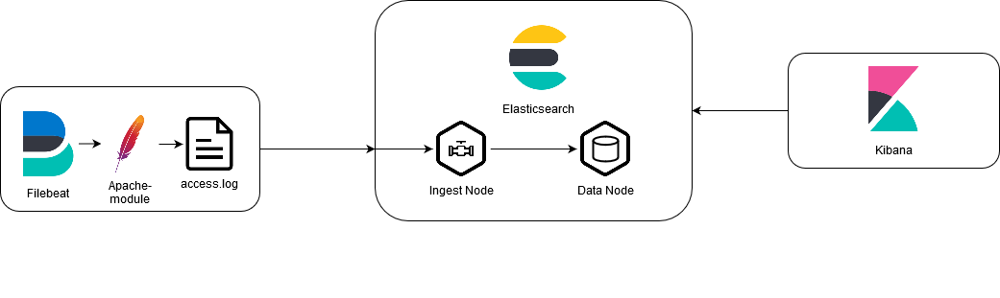

# Overview
This PoC uses Filebeat and the [apache filebeat module](https://www.elastic.co/guide/en/beats/filebeat/current/filebeat-module-apache.html)

In this PoC Filebeat is used in combination with the `filebeat apache module` to monitor the `/usr/share/data/accesss.log`-file on the local filesystem and output the data to elasticsearch.

When Elasticsearches receives data, the data is then processed using the defined ingest-pipeline `filebeat apache module`.

## Runtime Configuration
Kibana uses a custom runtime configuration to create an [index-pattern](https://www.elastic.co/guide/en/kibana/master/index-patterns.html).
This configuration is created when starting the docker-environment using the `run.sh` script.
The scripts used to perform runtime object creation can be found in the [setup](setup)-directory.

Filebeat uses the `apache` module, which defines an ingest-pipeline, aswell as a default index-template for the enabled module. This configuration is automatically applied by filebeat when run with docker.
