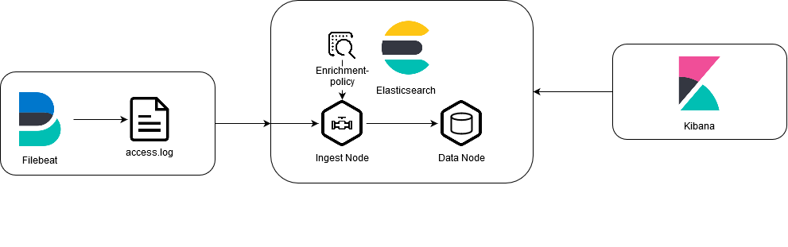

# Overview
This PoC uses Filebeat and an [Ingest-Pipeline](https://www.elastic.co/guide/en/elasticsearch/reference/current/ingest.html) as the main ingesting component.
For enrichment an [enrichment-policy](https://www.elastic.co/guide/en/elasticsearch/reference/current/enrich-policy-definition.html) is created and later used in the ingest-pipeline.

In this PoC Filebeat is used to monitor the `/usr/share/data/accesss.log`-file on the local filesystem and output the data to elasticsearch.

When Elasticsearches receives data, the data is then processed using the defined ingest-pipeline in the [filebeat.yml](filebeat/filebeat.yml)
During processing the `message` field is parsed using a `grok` filter to extract field values and an enrichment-policy is applied to lookup http status codes.
# Usage
To run the PoC simply execute the `run.sh` script. It will start all the docker-container and apply runtime configuration, aswell as output log messages and cleanup after you exit.
## Runtime Configuration
Elasticsearch and Kibana uses a custom runtime configuration to create an [index-template](https://www.elastic.co/guide/en/elasticsearch/reference/master/index-templates.html), the enrichment-policy, the ingest-pipeline and an [index-pattern](https://www.elastic.co/guide/en/kibana/master/index-patterns.html).
This configuration is created when starting the docker-environment using the `run.sh` script.
The scripts used to perform runtime object creation can be found in the [setup](setup)-directory.
- `00_cleanup.sh`: cleanes up index-templates, pipelines, etc. from previous runs.
- `01_create-index.sh`: Creates an index-template called `http_access_logs_template`, which is applied to every created index, which matches the pattern `http_access_logs*`. Defines index-settings, such as `number_of_shards`, `number_of_replicas` and [field-mappings](https://www.elastic.co/guide/en/elasticsearch/reference/current/mapping.html).
- `02_create-lookup-data.sh`: Creates an index to store lookup data in and uploades the data from [http_status_code_data.bulk](setup/http_status_code_data.bulk) into this index.
- `03_create-enrich-policy.sh`: Creates an enrichment policy matching the `status_code`-Field and adds the `status_desc`-Field to each event.
- `04_create-pipeline.sh`: Creates the ingesting pipeline, including the [enrich](https://www.elastic.co/guide/en/elasticsearch/reference/current/enrich-processor.html)-processor to enrich events.
- `05_create_kibana_index_pattern.sh`: Creates a kibana-index-pattern, which matches all `http_access_logs*`-indexes and sets the `timeFieldName` to `timestamp`.
