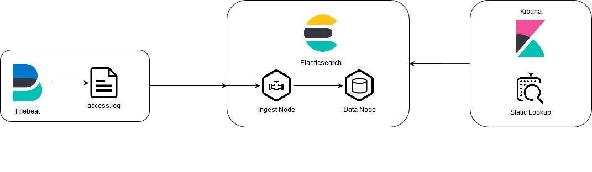

# Overview
In this PoC a [kibana static lookup](https://cinhtau.net/2018/08/27/static-lookup/) is used to map http status codes to status code text.
[Filebeat](filebeat) is used to ingest data into elasticsearch.

Diffrent to the other data-processing PoCs ([uc4_enrichment_policy](../uc4_enrichment_policy) and [uc5_logstash_lookup](../uc5_logstash_lookup/)) the lookup values aren't indexed with the rest of the data, but rather are looked up during search and are solely present in kibana itself.

## Runtime Configuration
Elasticsearch and Kibana uses a custom runtime configuration to create an [index-template](https://www.elastic.co/guide/en/elasticsearch/reference/master/index-templates.html), the ingest-pipeline and an [index-pattern](https://www.elastic.co/guide/en/kibana/master/index-patterns.html) with the static kibana lookup.
This configuration is created when starting the docker-environment using the `run.sh` script.
The scripts used to perform runtime object creation can be found in the [setup](setup)-directory.
