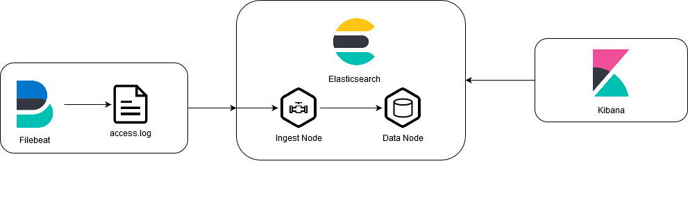

# Overview
This PoC uses Filebeat and an [Ingest-Pipeline](https://www.elastic.co/guide/en/elasticsearch/reference/current/ingest.html) as the main ingesting component.

This PoC uses [scripted-fields](https://www.elastic.co/guide/en/kibana/current/scripted-fields.html) to map `http status codes` to `status code text`.
This is usually done via the Kibana-Web-Interface and then automatically applied by kibana at search time.

Scripted-Fields are passed to a Elasticsearch query (https://www.elastic.co/guide/en/elasticsearch/reference/current/search-fields.html#script-fields).
This PoC shows how scripted-fields are applied. In Kibana they can be created in `Stack Management > Index Patterns > Select Index Pattern > Scripted Fields`.

*Scripted fields are limited in their usage in further search by the same request, but can be used in visualizations in Kibana*

Update 13.12.2020: Another possible way to calculate field during search is the use of [runtime-fields](https://www.elastic.co/guide/en/elasticsearch/reference/master/runtime.html).

In this PoC Filebeat is used to monitor the `/usr/share/data/accesss.log`-file on the local filesystem and output the data to elasticsearch.
When Elasticsearches receives data, the data is then processed using the defined ingest-pipeline in the [filebeat.yml](filebeat/filebeat.yml)
During processing the `message` field is parsed using a `grok` filter to extract field values.

# Usage
To run the PoC simply execute the `run.sh` script. It will start all the docker-container and apply runtime configuration, aswell as output log messages and cleanup after you exit.
## Runtime Configuration
Elasticsearch and Kibana uses a custom runtime configuration to create an [index-template](https://www.elastic.co/guide/en/elasticsearch/reference/master/index-templates.html), the ingest-pipeline and an [index-pattern](https://www.elastic.co/guide/en/kibana/master/index-patterns.html).
This configuration is created when starting the docker-environment using the `run.sh` script.
The scripts used to perform runtime object creation can be found in the [setup](setup)-directory.
- `00_cleanup.sh`: cleanes up index-templates, pipelines, etc. from previous runs.
- `01_create-index.sh`: Creates an index-template called `http_access_logs_template`, which is applied to every created index, which matches the pattern `http_access_logs*`. Defines index-settings, such as `number_of_shards`, `number_of_replicas` and [field-mappings](https://www.elastic.co/guide/en/elasticsearch/reference/current/mapping.html).
- `02_create-pipeline`: Creates the ingest-pipeline used to parse log events before they get indexed by elasticsearch.
- `03_create-scripted_field.sh`: *This does not work properly right now* (see [03_create-scripted_field.sh](setup/03_create-scripted_field.sh))
- `04_query_selected_field.sh`: Queries elasticsearch including a scripted field `http.response.status_code_desc`. Maps `status_codes` to descriptions for easier understanding. (e.g.: 200 -> 'Ok', 404 -> 'Not Found', .etc.)
