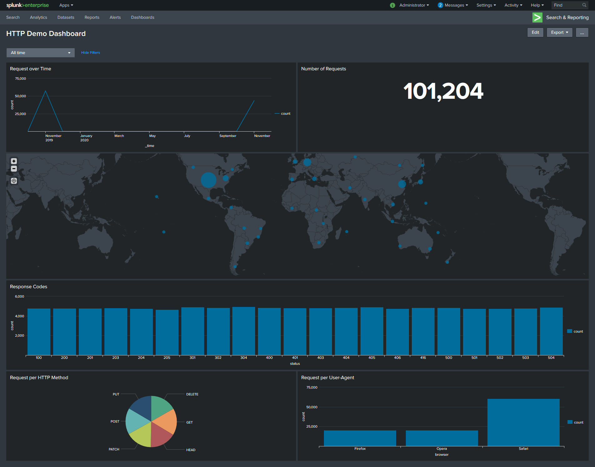
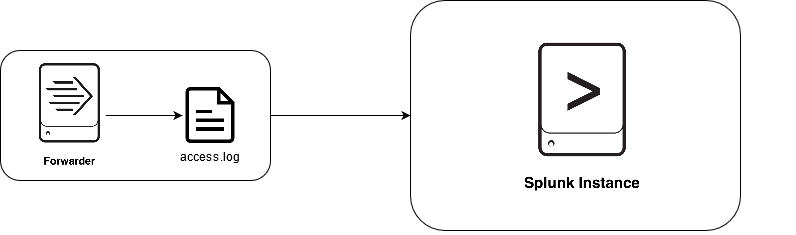

# Overview
This PoC shows the usage of a dashboard to combine multiple data visualiations into "a single pane of glass".
This PoC also showcases some of the available visualisations splunk provides.

The dashboard itself can be viewed in Splunk: http://localhost:8000/en-GB/app/search/http_demo_dashboard
The dashboard source (xml) can found [here](splunk/etc/apps/http_log_collection_TA/default/data/ui/views/http_demo_dashboard.xml).

For advanced purposes dashboards can also be created using HTML, CSS and JS, which allows for even more flexibility.

In this PoC the Universalforwarder is used to monitor the `/usr/share/data/accesss.log`-file on the local filesystem and output the data to Splunk.

# Usage
To run the PoC simply execute the `run.sh` script. It will start all the docker-container and apply runtime configuration, aswell as output log messages and cleanup after you exit.
## Configuration
Connectivity-configuration is handled in the [docker-compose.yml](docker-compose.yml).
Splunk configuration is applied using apps (see [apps](splunk/etc/apps)-directory).
Universalforwarder configuration is handled via the Forwarder-Management: Configuration is stored in apps in the [deployment-apps](splunk/etc/deployment-apps)-directory of splunk and is then automatically distributed to forwarder.
