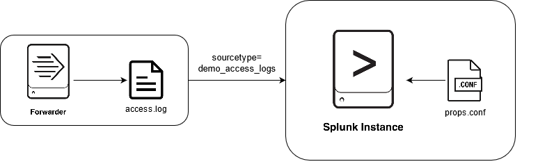

# Overview
This PoC uses the Splunk [Universalforwarder](https://www.splunk.com/en_us/download/universal-forwarder.html) as the main ingesting component.

In this PoC the Universalforwarder is used to monitor the `/usr/share/data/accesss.log`-file on the local filesystem and output the data to Splunk.
Splunk then stores the data in the `http_logs` index. Opposed to the other PoCs Splunk applies a custom sourcetype called `demo_access_logs` (see [props.conf](splunk/etc/apps/http_log_collection_TA/default/props.conf)) to extract fields when data is searched.
This allows to define custom sourcetype with custom field extractions and additional transformations, if no matching sourcetype is provided by Splunk.

# Usage
To run the PoC simply execute the `run.sh` script. It will start all the docker-container and apply runtime configuration, aswell as output log messages and cleanup after you exit.
## Configuration
Connectivity-configuration is handled in the [docker-compose.yml](docker-compose.yml).
Splunk configuration is applied using apps (see [apps](splunk/etc/apps)-directory).
Universalforwarder configuration is handled via the Forwarder-Management: Configuration is stored in apps in the [deployment-apps](splunk/etc/deployment-apps)-directory of splunk and is then automatically distributed to forwarder.
