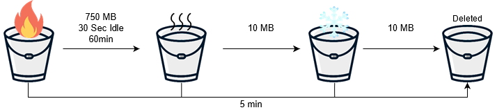

# Overview
This PoC uses the Splunk [Universalforwarder](https://www.splunk.com/en_us/download/universal-forwarder.html) as the main ingesting component.



In this PoC the Universalforwarder is used to monitor the `/usr/share/data/accesss.log`-file on the local filesystem and output the data to Splunk.
As the more data is ingested into Splunk and the stored data ages, Splunk applies certain Lifecycle-Policies to the index:
Data is first stored in a `hot bucket` when it gets indexed.
- After the hot bucket grows over 750MB in Size, an event gets older then 60min or the bucket is idle for 30 seconds, the bucket-data is then rolled over into a `warm bucket`.
```

# max hot bucket size in MB, before it gets rolled over to warm bucket
maxDataSize = 750

# max hot bucket age, before it gets rolled over to warm bucket
maxHotSpanSecs = 3600
maxHotIdleSecs = 30
```
- When a warm or bucket grows over 10MB in size, it is then rolled over into a cold/frozen bucket.
```
# props.conf part
# max hot/warm bucket size, before rolled over to cold
homePath.maxDataSizeMB = 10

# max cold bucket size, before rolled to frozen or deleted
coldPath.maxDataSizeMB = 10
```
- Data stored in any bucket is automatically deleted (or moved to a frozen path (not used here)) after 5mins.
```
# props.conf part
# max total age of data, before moved to frozen or deleted. Based on the timestamp of data (grouped by bucket)
frozenTimePeriodInSecs = 300
```

(also see [indexes.conf](splunk/etc/apps/http_log_collection_TA/default/indexes.conf), https://wiki.splunk.com/Community:UnderstandingBuckets and/or https://www.batchworks.de/manually-roll-buckets-from-hot-to-warm/)

# Usage
To run the PoC simply execute the `run.sh` script. It will start all the docker-container and apply runtime configuration, aswell as output log messages and cleanup after you exit.
## Configuration
Connectivity-configuration is handled in the [docker-compose.yml](docker-compose.yml).
Splunk configuration is applied using apps (see [apps](splunk/etc/apps)-directory).
Universalforwarder configuration is handled via the Forwarder-Management: Configuration is stored in apps in the [deployment-apps](splunk/etc/deployment-apps)-directory of splunk and is then automatically distributed to forwarder.
