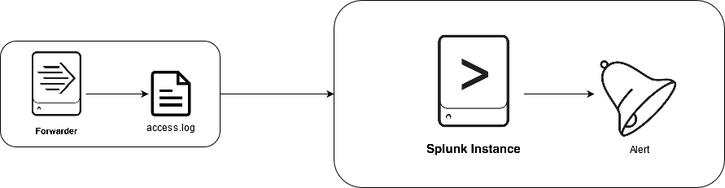

# Overview
This PoC shows the usage of alerts in Splunk.
Alerts are based on savedsearches which are executed on a predefined interval. If a certain alert-condition is matched, an alert is raised and shown in the Splunk web interface.
Raised Alerts can trigger various actions, e.g. sending an email, executing a custom script or send an HTTP POST request.

In this PoC an alert is created, which raises a notification in Splunk, if the number of events with an HTTP Internal Server Error exceeds 500 per hour.
(Because events aren't kontinually ingested into splunk, the `_index_earliest/latest`-fields are used to filter by time, instead of `earliest / latest)`

In this PoC the Universalforwarder is used to monitor the `/usr/share/data/accesss.log`-file on the local filesystem and output the data to Splunk.

# Usage
To run the PoC simply execute the `run.sh` script. It will start all the docker-container and apply runtime configuration, aswell as output log messages and cleanup after you exit.
## Configuration
Connectivity-configuration is handled in the [docker-compose.yml](docker-compose.yml).
Splunk configuration is applied using apps (see [apps](splunk/etc/apps)-directory).
Universalforwarder configuration is handled via the Forwarder-Management: Configuration is stored in apps in the [deployment-apps](splunk/etc/deployment-apps)-directory of splunk and is then automatically distributed to forwarder.
